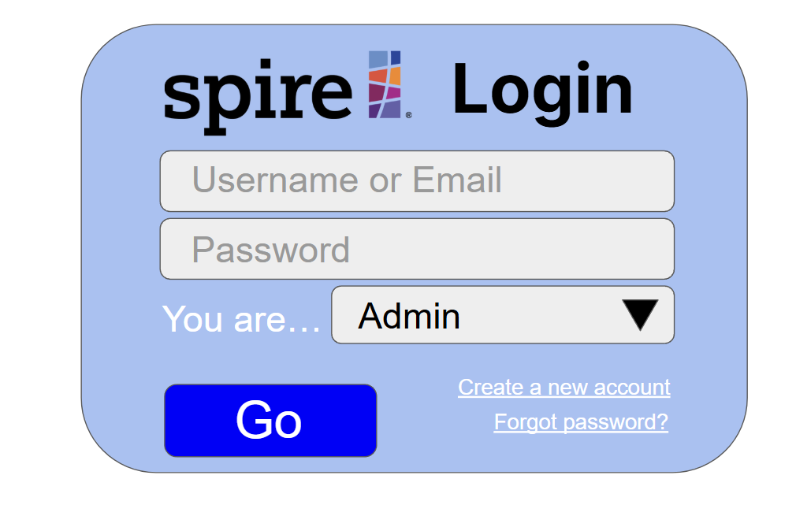
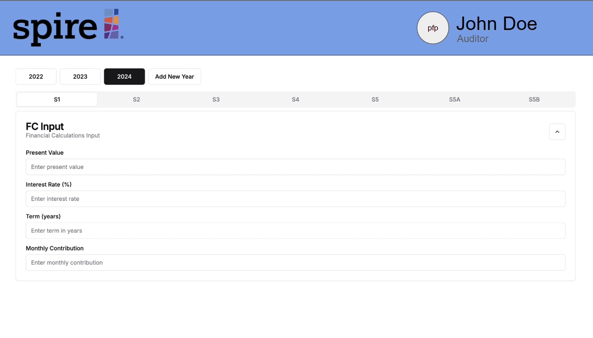
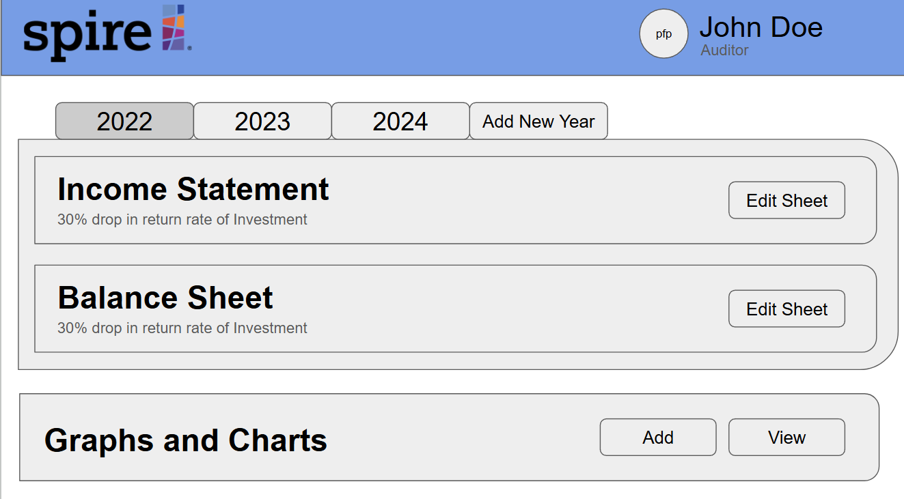
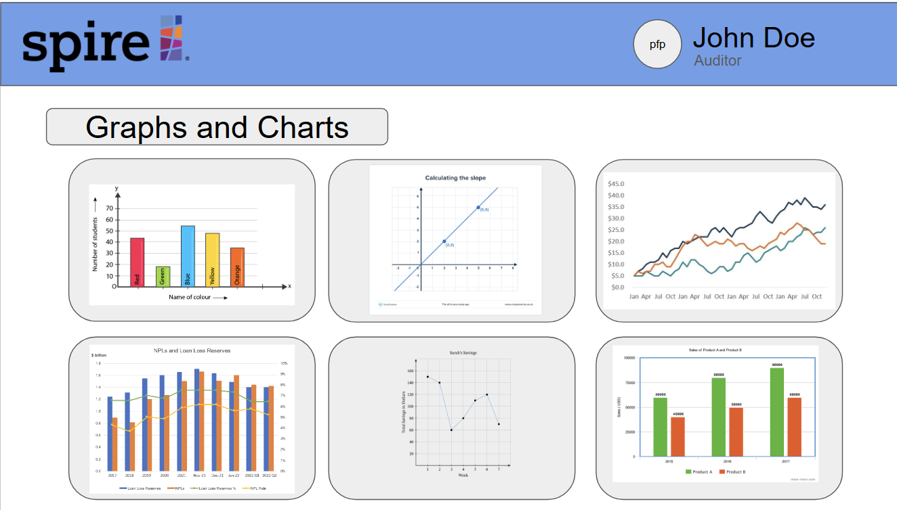
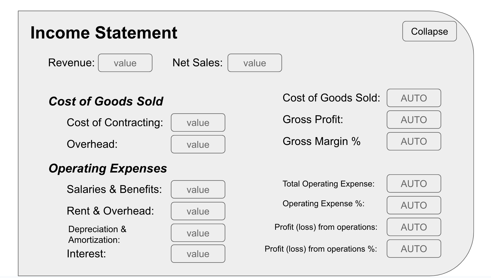
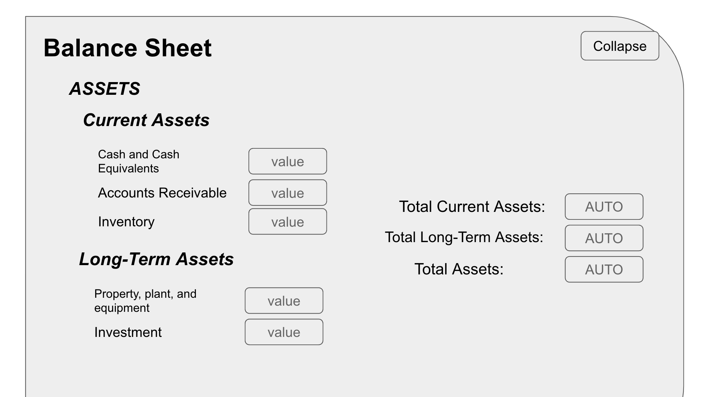
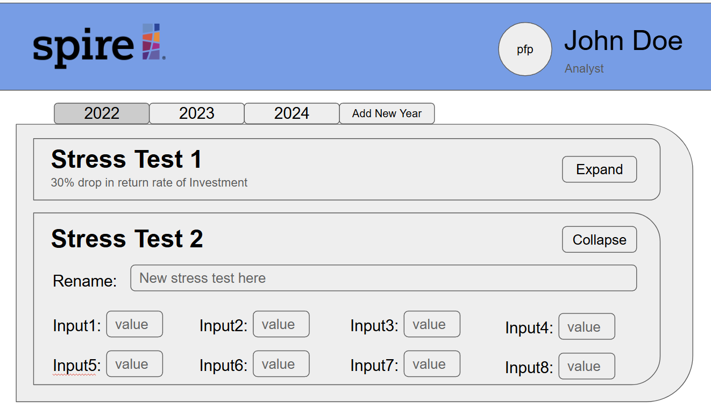
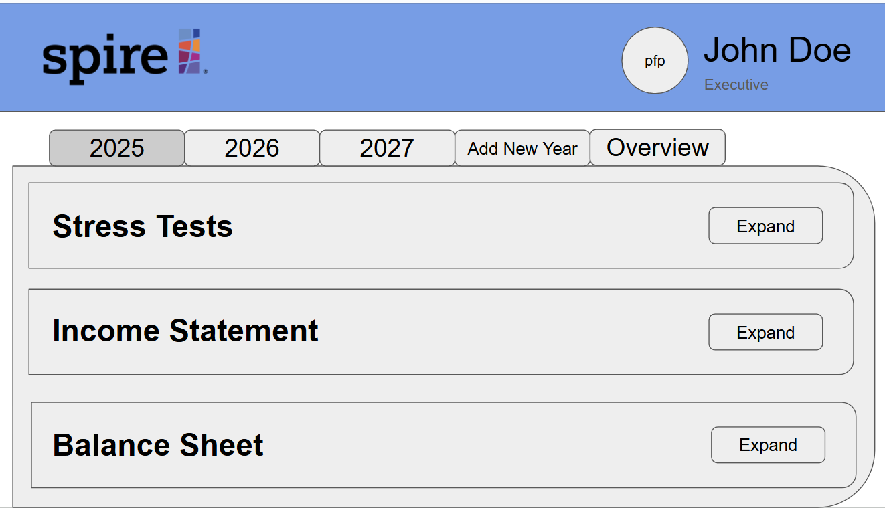
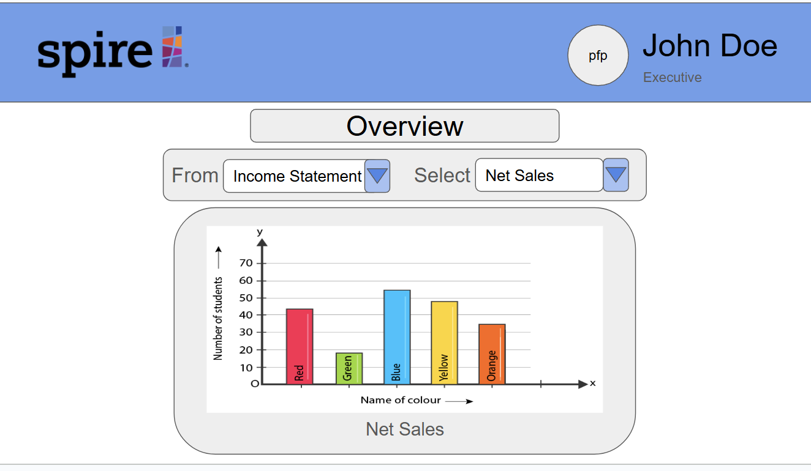
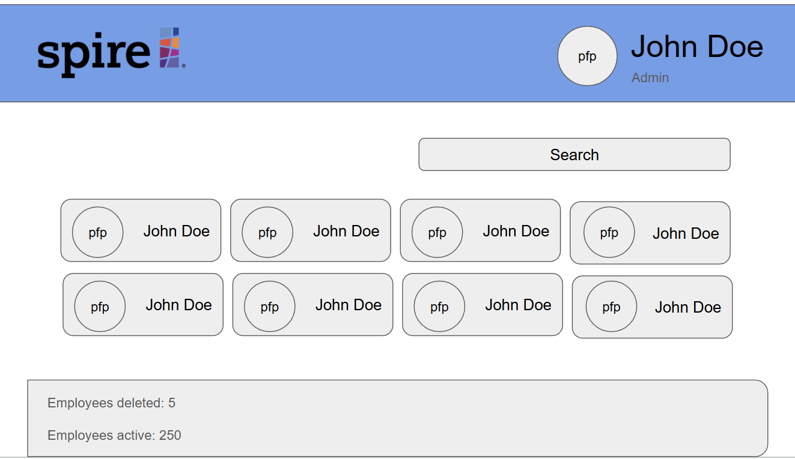

# Aspire25 Homepage

## Table of contents

* [Overview](#overview)
* [Deployment (Coming Soon)](#deployment)
* [User Guide (Coming Soon)](#user-guide)
* [Community Feedback (Coming Soon)](#community-feedback)
* [Developer Guide (Coming Soon)](#developer-guide)
* [Development History (Coming Soon)](#development-history)
* [Continuous Integration (Coming Soon)](#continuous-integration)
* [Walkthrough videos (Coming Soon)](#walkthrough-videos)
* [Example enhancements (Coming Soon)](#example-enhancements)
* [Team](#team)
* [Links](#links)

## Overview

This project aims to develop a web application for [Spire](https://www.spirehawaii.com/), a Hawaii-based CPA firm, as part of our ICS 414 Software Engineering class. This application will transition Spire’s Fiscal Sustainability Model (FSM) from a complex Excel-based tool to an intuitive, web-based platform, streamlining access and enhancing functionality for financial forecasting.

## M1 Mockups
### Login page

### Forum page

### Auditor Landing page

### Auditor Figures Page

### Auditor Income Statement Page

### Auditor Balance Sheet Page

### Analyst Landing Page

### Executive Landing Page

### Executive Overview Page

### Admin Landing Page

## Team
Aspire25 is designed, implemented, and maintained by: 

<table style="border: none;">
  <tr>
    <td style="border: none; border-bottom: none; text-align: center;">Chester Leoso</td>
    <td style="border: none; border-bottom: none; text-align: center;">Junle Yan</td>
    <td style="border: none; border-bottom: none; text-align: center;">Karissa Tabadero</td>
    <td style="border: none; border-bottom: none; text-align: center;">Mairi Yoshioka</td>
  </tr>
  <tr>
    <td style="border: none; border-bottom: none; text-align: center;">Micaiah Cape</td>
    <td style="border: none; border-bottom: none; text-align: center;">Michaella Villanueva</td>
    <td style="border: none; border-bottom: none; text-align: center;">Sage Suzuki</td>
  </tr>
   
</table>

Visit our [Github Organization](https://github.com/aspire-25) here.

## Links
See our [Team Contract](https://docs.google.com/document/d/1GpYGwK2xRSj14FGqq4h1G9N7zqfQE65u1zC3gbeW-GA/edit?usp=sharing) here.

Our [M1 Project Board](https://github.com/orgs/aspire-25/projects/1).

Our [M2 Project Board](https://github.com/orgs/aspire-25/projects/2).
